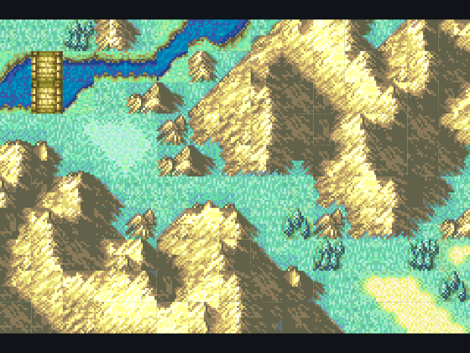

# FE8 重制版

[](https://github.com/cqiang102/fe8r/actions/workflows/ci.yml)

《火焰之纹章：圣魔之光石》（Fire Emblem: The Sacred Stones）的 Flutter / Flame 重制版。

基于 [fireemblem8j](https://github.com/laqieer/fireemblem8j) 的反编译源码，
把**规则**逐位 1:1 移植到 Dart，把**表现**用 Flutter / Flame 重新实现。

完整设计见 [`docs/技术方案.md`](docs/技术方案.md)。

> 仅供个人学习研究，不对外分发。音乐沿用原版，美术基于原版由 AI 重新生成。

---

## 现状（M0）



上图是**程序真实渲染的一帧**（应用自截图，不是示意图）。
链路是完整打通的：

```
third_party/fireemblem8j  graphics/map/layout/PrologueMap.mar   （GBA 二进制）
        │  tools/pipeline/extract/map_tmx.py
        ▼
assets/maps/prologue.tmx + prologue.metatiles.png ──► lib/game  flame_tiled
assets/maps/prologue.json                        ──► lib/core  规则数据
        │  fvm flutter run -d macos
        ▼
        画面上这片山、这条河、这座桥
```

同时 `lib/core` 拿到了地形分布，可与画面互相印证：

```
地形分布 {PEAK: 101, PLAINS: 32, RIVER: 10, FOREST: 5, BRIDGE_REGULAR: 2}
```

已完成：

- [x] Flutter 3.47.6 / Flame 1.38.2 工具链（`.fvmrc` 锁定）
- [x] 三层骨架 + **架构约束 lint**（7 条规则，机器强制而非自觉）
- [x] `lib/core` 第一个模块：**乱数** —— 通过 C Oracle，161 用例逐位相同
- [x] `lib/core` 地图语义形式 —— 与 `.mar` 二进制逐格对照
- [x] 数据管线接通渲染：`.mar` → `.tmx` → Flame 画面
- [x] 统一验证入口 `tools/verify/run_all.dart`，5 项全绿
- [x] **M1 全量分层分类** —— 6213 个文件全部有结论，未分类 0（[`tools/m1/`](tools/m1/README.md)）
- [x] CI（GitHub Actions，3 个 job，已跑通）
- [x] **M3 单位与移动范围** —— 地形消耗表 + BFS 泛洪，54 用例与真实 C 逐格一致
- [x] **M4 战斗结算** —— 数值层 + 攻击力/特效 + **乱数消耗追踪** + 武器三角/命中率
      （655 用例与真实 C 逐值一致）
- [~] **M5 回合流程 + UI 框架** —— 阵营/阶段规则层（103 用例）+
      **交互流程状态机与输入闭环**（11 用例）。战斗结算接入、行动菜单其余选项待做

---

## 快速开始

```bash
# 1. 版本由 fvm 锁定（Flutter 3.47.6 / Dart 3.13.5）
fvm install
fvm flutter pub get

# 2. 拉取反编译源码（数据管线与 C Oracle 都需要）
git clone --depth 1 https://github.com/laqieer/fireemblem8j third_party/fireemblem8j

# 3. 跑起来
fvm flutter run -d macos
```

### 网络

Flutter 官方源在国内实测只有 ~76 KB/s，会卡在 Dart SDK 下载上。
两种方式二选一：

```bash
# 方式 A：本地代理
export all_proxy=http://127.0.0.1:7890

# 方式 B：官方国内镜像（实测 11 MB/s）
export FLUTTER_STORAGE_BASE_URL=https://storage.flutter-io.cn
export PUB_HOSTED_URL=https://pub.flutter-io.cn
```

---

## 分层

依赖方向**只能** `core ← game ← ui`，反向依赖会被架构检查拦下。

| 目录 | 角色 | 约束 |
|---|---|---|
| `lib/core` | **规则层** —— 1:1 移植反编译 C | 纯 Dart；无 Flutter / Flame / `dart:io`；无 `DateTime.now` / `Random`；无 `async`；每文件带 `PORT OF:` 头 |
| `lib/game` | **表现层** —— Flame 重新实现 | 可依赖 core |
| `lib/ui` | **外壳层** —— Flutter widget | 可依赖 core / game 的公开入口 |

`lib/core` 的四条硬约束不是洁癖，各有具体理由：

- **无 Flutter / Flame** —— 规则要能在没有 UI 的环境里跑测试，C Oracle 对照才能做
- **无 `dart:io`** —— 存档必须能跨平台序列化，由外层注入字节
- **无 `DateTime.now` / `Random`** —— 时间和随机数必须注入，否则存档回放不可能一致
- **无 `async` / `await`** —— 事件引擎必须是可中断、可存档的状态机；`async` 的调用栈序列化不了

这些都由 `tools/verify/check_architecture.dart` 机器强制，**不靠自觉**。

---

## 验证

```bash
./tools/verify/ci.sh          # CI 跑的就是这一条（本地同样可用）
dart run tools/verify/run_all.dart   # 或者只跑检查，不装环境
```

> **YAML 只负责装环境，检查什么由 `tools/verify/ci.sh` 决定。**
> 本地和 CI 走同一条路径，因此"本地绿、CI 红"基本不会发生。

五层验证金字塔（技术方案 §6），原则是**每个检查都必须有客观判据**，不接受"看着对"：

| 层 | 检查 | 现状 |
|---|---|---|
| L0 | 架构约束（core 层纯净性 + 可追溯性） | ✅ 7 条规则 |
| L0 | 数据管线往返（`.mar` ↔ 网格 字节级无损） | ✅ 66/66 张地图 |
| L1 | 地图语义形式（含与 `.mar` 二进制逐格对照） | ✅ |
| L0 | 数据表提取（判据是 **C 编译器**本身） | ✅ 135 张 / 7008 个值逐字节一致 |
| L2 | **C Oracle** —— Dart 移植 vs 真实反编译 C 代码 | ✅ 973 条向量 |
| L1 | **M1 全量分层分类**（6213 个文件，未分类须为 0） | ✅ |
| L3 | 静态契约（`flutter analyze --fatal-infos`） | ✅ |
| L4 | 视觉验证 | ⬜ 待做（抓帧能力已备好，见 `lib/ui/debug_screenshot.dart`） |

### CI

`.github/workflows/ci.yml` 三个 job：

| job | runner | 内容 |
|---|---|---|
| 验证金字塔 | `ubuntu-latest` | `./tools/verify/ci.sh` —— 上面 6 项全部 |
| C Oracle 全量编译覆盖率 | `ubuntu-latest` | 逐文件试编译反编译项目的全部 C（约 80s，仅在 main / 手动触发） |
| macOS 构建 | `macos-latest` | 在**目标平台**上真的构建一次，并确认地图资源打进了 bundle |

> **YAML 只负责装环境，检查什么由 `tools/verify/ci.sh` 决定。**
> 本地跑 `./tools/verify/ci.sh` 与 CI 走完全同一条路径。
>
> 两条链路都在 Docker 里用 `ubuntu:24.04` + clang 18 实测过：
> C Oracle 451 条向量全绿，数据管线 66 张地图往返无损。
> 所以"CI 上跑不跑得起来"不是猜的。

### 关于 C Oracle

`tools/oracle/` 把**第三方反编译项目里真实的 C 代码**在宿主机上编译并运行，
产出的结果就是 Dart 移植的"标准答案"。反编译项目自己的 CI 已经证明了
`源码 ≡ ROM`，所以 Dart ≡ C 蕴含 Dart ≡ ROM——**全程不碰任何 ROM**。

这比手写期望值强得多：手写的期望值只能证明"我算得跟我自己一致"。

---

## 数据管线

`tools/pipeline/` 把 GBA 格式资产转成**语义形式**：

```
graphics/map/layout/PrologueMap.mar       （GBA 二进制，格子网格）
graphics/map/TileConfiguration1.S         （metatile 定义 + 地形查表）
graphics/frontier_map_objtype/*.png       （4bpp 索引图集）
graphics/map/MapPalette1.pal              （调色板）
        │
        ├──► prologue.tmx + 图集 PNG   ──►  lib/game（Flame 渲染）
        └──► prologue.json             ──►  lib/core（规则计算）
```

**两条线刻意分开**：`.tmx` 是视觉格式，`.json` 是纯数据。
让 `lib/core` 去解析 Tiled 的 XML 是架构错误——将来换渲染方案时规则层不该跟着动。
两者由同一管线从同一份数据导出，因此不可能不一致。

管线里踩过的坑（都很隐蔽，详见 [`tools/pipeline/README.md`](tools/pipeline/README.md)）：

- **调色板 bank 内部顺序是反的** —— 不修的话明暗反相，**地图看着仍像地图**，肉眼极易放过
- **资产表注释从下标 47 起整体错位** —— JP 比美版少了两个调色板，注释是从美版抄的
- **frontier 图集的真瓦片宽度反编译项目自己都没 pin**

---

## 目录

```
lib/core/          规则层（纯 Dart）
  battle/          战斗数值 + 乱数消耗（已通过 C Oracle）
  map/             地图语义形式 + 移动范围 BFS（已通过 C Oracle）
  rng/             乱数（已通过 C Oracle）
  terrain/         地形类型（决定移动/回避/防御）
lib/game/          表现层（Flame）
lib/ui/            外壳层（Flutter）
assets/maps/       数据管线导出的地图
docs/              设计文档
tools/oracle/      C Oracle：编译真实反编译 C 作为判据
tools/pipeline/    数据管线：GBA 资产 → 语义形式
tools/m1/           全量分层分类（移植 / 重写 / 舍弃）
tools/verify/      架构检查与统一验证入口
third_party/       反编译源码（gitignore，需自行 clone）
```

---

## 红线

有些东西**绝不能**因为"重做 UI"而改动，它们是游戏规则：

- 地形类型网格与地形查表
- 地图尺寸与格子坐标
- 天气对移动力的影响（`pMovCostTable[0..2]`）
- 雾战可见性判定
- 地图变更的触发条件与效果
- 乱数的消耗顺序（错一位，后面全部错位）

可以换的：视觉瓦片、渲染方式、存储格式、编辑器。
