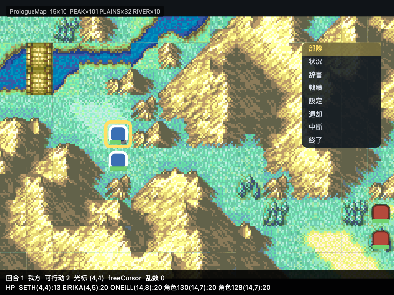

# 「第一章及之前」还差什么（如实记录）

> 这份文件是**现状**，不是计划。写法按 `AGENTS.md` 的四类口径：
> **机器验证 / 抽查过 / 未验证 / 已知有 bug** —— 不许让第一类吸收后三类。

---

## 开场链路与序章：逐句核对用户描述（最新一轮）

用户的原话（逐条核对结果）：

| 用户说的 | 源码 | 实现状态 |
|---|---|---|
| 先有动画，之后要按 **Press Start** | `gProcScr_GameControl`：① `ProcScr_GameEarlyStartUI`（Nintendo/IS/健康警告，等按键）→ ② `ProcScr_OpAnim`（开场动画）→ ④ 标题画面（提示 = 消息 1749「スタートを押すと始まります」）| ①④有；**②开场动画整段没实现** |
| 不按开始键，过一会播各角色/职业介绍 | `src/titlescreen_080CB2A0.c:33-52` `Title_IDLE`：`timer_idle == 815` → `GAME_ACTION_CLASS_REEL`；`GameControl_PostIntro` 里按 `idle_status & 1` 在 CLASS_REEL / OP_ANIM 之间交替 | 815 帧 → 职业介绍 ✓（有测试）；**少了"回开场动画再回标题"这一跳** |
| 按 Press Start 进入有背景、可交互的 UI，可选新游戏 / 附加内容 | `LGAMECTRL_EXEC_SAVEMENU` → `StartSaveMenu`；`InitSaveMenuChoice.c` 的 6 个选项按存档数出现 | ✓（附加内容不实现，且**留在原地不静默跳走**）|
| 新游戏 → 难度（新手/普通/困难） | `gTextIds_DifficultyDescription` = 消息 2098/2099/2100 | ✓ |
| 难度 → 存档槽新建 | `StartSaveMenu` 的槽选择 | ✓（存档写入是 M9，未做）|
| 然后才是序章，**鲁内斯陷落**，也有动画和介绍，跳过动画才正式进入游戏 | `GameCtrlStartIntroMonologue`（**只在 `chapterIndex == 0`**）→ `StartIntroMonologue` → `Proc_StartBlocking(gProcScr_OpSubtitle)`；`src/opsubtitle.c` 注释：*"The opening monologue that introduces the Sacred Stones / associated lore"*；标题 `titles['L00'] = 消息 232「ルネス陥落」`；可跳过（符号 `OpSubtitle_HandleStartPress`）| **没实现**（`gProcScr_OpSubtitle` 未 carve：`layout/us_jp_funcmap.tsv` 说是 masked、480 字节 @ 08AA21BC）|
| 卫兵向国王报告的背景地图是**王宫里** | `EventScr_Prologue_RenaisThroneCutscene` 第一次 `LOMA(0x10=16)` → `Ch16Map`（渲染出来是城堡内景 + 王座）| ✓ **已核对画面** |
| 之后还有**王宫外**的场景 | 第二次 `LOMA(0x40=64)` → `RenaisCastleMap` | ✓ **本轮刚修好**（原来静默不换图）|
| 再后面才到序章游玩地图，也有剧情 | 第三次 `LOMA(0)` → `PrologueMap` + `LOAD1(PrologueAlly)` + `MOVE` + `GiveRapier` + `ONeillSpawn` | ✓ |

真机转储（`./tools/verify/scenario.sh prologue`，**17 条判据全过**）：

```
✓ 序章：地图历史里有 Ch16Map         — history=Ch16Map RenaisCastleMap PrologueMap
✓ 序章：地图历史里有 RenaisCastleMap
✓ 序章：地图历史里有 PrologueMap
✓ 序章：没有 LOMA 失败               — failures=[]
✓ 艾莉卡拿到了细剑（9）              ✓ 赛特带着 3 件道具
```

三幕画面：`docs/images/prologue-throne-room.png`（**镜头已在王座上**）、
`prologue-outside-castle.png`、`prologue-playable-map.png`。

### 王座厅的取景：`CAMERA` + 一个"镜头被拖走"的 bug

`CAMERA(0xE, 0)` 一直是**占位符**（宏解析漏了 `_EvtSubParam16u8` 那种打包写法），
所以镜头停在地图中央。补上之后仍然不对 —— 转储里 `camera=(48,0)`，
而按源码算应该是 `(96,0)`：

```
LOMA(0x10)  → GetCameraCenteredX(14*16) = 96   （槽 0xB 的相机）
CAMERA(14,0)→ GetCameraAdjustedY(0)     = 0    （y 顶到王座）
GetCameraAdjustedX(96, 224)             = 96   （x 在死区内，不动）
```

差在 96 → 48：`update()` 里"相机每帧跟光标"**在过场里也在跑**，
玩家光标停在 (2,2)，每帧把镜头拖回 0；`CAMERA` 再从 0 算 → 48。

出处：`HandlePlayerCursorMovement` 的调用点是 `PlayerPhase_MainIdle`
（`src/playerphase_0801C5A8.c:62`）—— **事件演出期间没有这一步**。
修法是加 `!_sceneRunning`。

判据：`./tools/verify/scenario.sh throne`（11 条，含 `camera == (96, 0)`）。

### 本轮修掉的 4 个 bug（都属于"静默失败"）

| # | Bug | 后果 |
|---|---|---|
| 19 | `chapter_maps.json` 按**资产符号名**建表（`CH65`），而 `chapters.json` 里那一章叫 `'-'` | `LOMA(64)` **静默不换图** → 序章"王宫外"整段消失；脚本里 46 个 LOMA 目标有 **11 个**受影响 |
| 20 | `LOMA` 的相机坐标在**槽 0xB**（低 16=x，高 16=y），没读 | 取景只能居中到地图中央，不是脚本要的那一块 |
| 21 | `chIndex` 是**有符号 short**，`LOMA(0xFFFF)` 意思是"章节号取槽 2" | 当成 65535 → 永远查不到地图（`EventScr_CutsceneExecEnd_Sub1` 真的这么写）|
| 22 | `assets/maps/` 只打包了 3 张图，而 LOMA 目标有 40+ | 缺图时只写一句 HUD，**转储地图历史看不出缺** |

> 顺带戳破一个**旧结论**：`docs/images/ch1-map.png` 被当成"第一章地图加载了"，
> 而那张图的 HUD 明明白白写着 **`PrologueMap`** —— 图根本没换。
> **`Ch1Map` 直到本轮才打包进来。**

新增的机器判据（都进了门禁）：

* `tools/verify/check_map_assets.dart` —— 每个 `s.loadMap(N)` 都要能解析出地图名；
  已打包的图必须与 `tools/pipeline/out/tmx/` **逐字节相同**；缺图数量记成**棘轮**（只许变少）
* `test/core/loma_test.dart` —— 槽 0xB 相机、`0xFFFF` 有符号、序章三张图、
  「`internalName` 是 `-` 的章节也必须查得到」
* `check_dump.dart` 序章判据 14 → **17 条**（含"地图历史里必须有三张图"）

---

## ★ 序章 → 第 1 章：**真机端到端已打通**（本轮）

```
./tools/verify/scenario.sh battle      → 13 条判据全过
  ✓ 切到了第 1 章（chapter 字段）      — chapter=1
  ✓ 地图是 Ch1Map                      — map.id=Ch1Map
  ✓ 地图历史里出现 Ch1Map              — Ch16Map RenaisCastleMap PrologueMap Ch1Map
  ✓ 命中的是序章结束脚本               — objectiveHit=EventScr_Prologue_EndingScene
  ✓ 第 1 章场上有单位                  — alive=11
```

链路：**打死奥尼尔 → `EVFLAG_DEFEAT_BOSS` → 命中 `EventScr_Prologue_EndingScene`
→ `MNC2(1)` → 换到 `Ch1Map`** —— 全部发生在真实对局里，
战斗本身**没有用任何调试开关**（只用了 START 跳过过场，那是游戏本来就有的功能）。

### 为了走到这一步，本轮修掉的 4 个 bug

| # | Bug | 症状 |
|---|---|---|
| 23 | 过场里"相机每帧跟光标"没有排除演出 | 镜头被拖回玩家光标处 |
| 24 | `MOVE*` 四种参数形状当成一种读 | 剧情里人走到错格子 / 根本没动 |
| 26 | 单位编号从 `0x100` 起 → **超出阵营区块** | `phaseAbleCount(red) == 0` → **敌方阶段被自动跳过** → AI 一步不走 |
| 27 | `terrainBonuses` 返回 `(avoid, defense)`，调用点按 `(def, avo)` 解构 | 山峰的 **40 回避**被当成防御 → 伤害恒为 0 |
| 28 | `_loadObjectives()` 跑在 `_loadChapterLinks()` 之前 | 胜负条件表**从未载入** → 打死首领也不切章 |

外加：`MapUnit.movement` 一直用默认值 5（没接职业表）→ 赛特（圣骑士，8）走不到人面前；
`ClassTable` 的移动消耗表里 `-1` 没转成 255。

### 换章之后画面是黑的 —— 已修

第一次跑通时截图**全黑**：`MNC2` 之前那次 `FADI` 留下的黑屏没人散。
原作是靠**章节标题卡**把它淡回来的
（`src/ChapterIntro_DrawChapterTitle.c:23` 画标题 +
`src/chapterintrofx_0802099C.c:46` 的 `ChapterIntro_LoopFadeToMap` 混合淡入）。

现在 `_gotoChapter` 里补了这一步：**章节标题卡**（真标题文本，
`texts.titles[内部名]`，如 `L01` = 消息 233「脱出行」）→ 地图淡入。
可 START 跳过（对应 `ChapterIntro_TickTimerMaybe` 的 `if (proc->isSkipping)`）。

判据里加了一条**像素**检查（转储看不出黑屏）：

```
[scenario] 画面非黑像素比例 1.000（264000 个像素）
```

⚠️ 两处如实说明：**底色图没有移植**（用纯色底代替，
`_PutChapterTitleGfx` 的整屏图块还没解）；**停留时长未查证**
（初值在未 carve 的 `gProcScr_ChapterIntro` 里，这里取 2 秒）。

### ✅ 回合系统：补齐三处缺的（本轮）

"回合"这条链原来只做了**一半**：阶段切换与回合数是对的，但三件事没做 ——
它们都不报错，只是"该发生的事"不发生：

| 缺的东西 | 出处 | 症状 |
|---|---|---|
| **回合事件表**（`turnBasedEvents`）从未载入 | `RunPhaseSwitchEvents`（`src/RunPhaseSwitchEvents.c:38-49`）+ `EvCheck02_TURN`（`src/eventinfo_08085B30.c:69-88`）| 序章的回合 1/2/3 事件与"奥尼尔攻击"教学**一次都没演过** |
| `CALL(指针)` 被解成 `callSlot(0)` | `Event0A_Call`（`src/sub_800DC40.c:8-11`）+ `EvtCall`（`include/eventscript.h:607`）| 被调脚本**整段丢掉**（`EventScr_Prologue_Turn1` 一个动作都没有）|
| 敌人 **不自动结束回合**、AI 行动后不查等待事件 | `PlayerPhase_HandleAutoEnd`（`src/playerphase_0801D808.c:52`）、`gProcScr_CpPerform`（`src/data/data_085D1F2C/data_085D1F2C.c:40`）| 最后一个单位行动完不会自动进敌方阶段；**敌方阶段里打死首领不触发结束脚本** |

### ✅ 已接上：真实移动消耗表（按职业 × 天气）

出处 `src/masked_08018a60.c` 的 `GetUnitMovementCost`：

```c
WEATHER_RAIN            → unit->pClassData->pMovCostTable[1]
WEATHER_SNOW/SNOWSTORM  → unit->pClassData->pMovCostTable[2]
default                 → unit->pClassData->pMovCostTable[0]
```

天气取当前章节数据的 `initialWeather`（`include/types.h:355-362`）。
原来全场共用一张"除 0 号地形外全 1"的演示表 → **山峰也能走**。
现在山峰（`TERRAIN_PEAK = 0x12`）对绝大多数职业是 255 = 不可通行，
圣骑士的森林代价 3、山地 6 —— 走位与原作一致了。

接上之后**立刻暴露两个真 bug**（都是"不报错、链不走"）：

| # | Bug | 症状 |
|---|---|---|
| 29 | 选中单位后，光标**不允许经过友军格** | 序章艾莉卡站在 (4,5)，那是赛特通往东侧的唯一一格（三面山峰）→ **赛特一步都走不出去**。原作路径箭头只看"在不在移动范围内"（`src/UpdatePathArrowWithCursor.c:31`），"不能停在别人身上"是确认时的规则 |
| 30 | 阶段推进把"清灰化"和"能不能动"**顺序弄反** | 清的是**新**阵营、且只在它有人能动时清 → 被跳过的阵营永远全灰 → **第 2 回合起敌人一步都不动**（第 1 回合正常，因为单位刚载入）。原作 `BmMain_ChangePhase` 清的是**即将结束的**阵营（`src/bm_08015434.c:85-87`）|
| 31 | `LOAD1` **不查"这个角色已经在场上"** | 序章敌人被载入两次（开场脚本末尾 + 回合 1 事件）→ 奥尼尔和两个杂兵各变成两份。原作 `LoadUnit_0`：找到同角色就不新建（`src/eventscr_0800F8D4.c:45-95`）|
| 32 | 事件标志被"每演完一条胜负条件就清空" | `doneFlag` 形同虚设 → `OneEnemyLeft` 无限重演；刚推导出的 `EVFLAG_DEFEAT_BOSS` 每次被抹掉 → **打死首领切不到下一章**。原作在战斗地图开始时清（`StartBattleMap` → `ResetChapterFlags()`，`src/bmio_08030D50.c:151`）|
| 33 | 我自己引入的：光标"不能停在有人格子上"**把自军那格也挡了** | **原地待机按不出来**（不是"多按一下"）。自己的格子必须合法（`src/UpdatePathArrowWithCursor.c` 只管范围，占用是确认时判、且要排除自己）|

### ⚠️ 这条判据的边界（如实说）

* `scenario.sh battle` 是一段**固定输入脚本**，靠"AI 是确定性的"成立。
  移动消耗表、单位坐标、移动力任一变化，它就会**红**（这正是我们要的）。
* 接上真实表后这段脚本**已经重新调过**：路线变成
  `(4,4) → 穿过 (4,5) → (8,5) → (9,5)→(9,6 林)→(9,7)→(10,7 林)` → 打奥尼尔。

## 用户报的三处（上一轮），逐个查证的结果

| 用户说的 | 查证结果 | 根因 |
|---|---|---|
| 开场链路有 bug | **真的** | `TitleFlow.tick()` 只在**按键**时被调用 → 时间驱动的画面（Nintendo/IS 淡入淡出、815 帧超时）实际是"按键次数"驱动 |
| 序章剧情有 bug | **真的** | 道具栏只有 1 个元素 → `UnitAddItem` 永远失败 → **艾莉卡拿不到细剑**；过场里 `Event_TextWithBG` 那几段仍然缺失 |
| 序章战斗有 bug | **真的** | 战斗结算器持有的是**演示道具表**（`ItemTable(8)`），细剑是 9 号 → 查不到 → 威力 0 |

**6 次「不对」全中，这次是第 7、8、9 次。**

---

## 机器验证（有可重复执行的检查）

| 项 | 判据 | 在哪 |
|---|---|---|
| 道具栏是 `UNIT_ITEM_COUNT = 5` 槽 | 长度 == 5；满了 `addItem` 返回 -1 | `test/core/inventory_test.dart`（14 条）|
| 单位装载按源码（4 个道具槽，0 是终止符）| 赛特 {3,23,108} 全在；`0` 之后的槽不再看 | 同上 + `chapter_loader_test` |
| 结算器用真实表 | `combat.items.length == 256`、细剑 might=7 | `test/game/battle_data_wiring_test.dart` |
| 属性位接上了 | `attributesOf(1) & IA_WEAPON != 0` | 同上（证伪：换演示表 → 8 vs 256）|
| 序章一击伤害 | **== 10** = 4(pow)+7(细剑)+1(三角)−2(守方防御) | 同上 |
| 开场链路按帧 | 不给按键 100 帧 → Nintendo→IS；按 100 次键不推帧 → 画面不变；815 帧 → 职业介绍 | `test/game/title_flow_wiring_test.dart`（5 条，打的是 `Fe8Game.update`）|
| 胜负判定 + 切章 | `EndingScene → ChangeChapter(1)` 场景级判据 | `test/core/scene_script_test.dart` 等 14 条 |
| 抽取器：道具属性位求值 | `ITEM_SWORD_RAPIER.attributes == 262161`（= 源码表达式）| `tools/pipeline/extract/parse_char_item_data.py` 的正向抽查 |
| **真机转储判据** | 14 条：id 唯一 / 渲染数==存活数 / 5 槽 / 坐标 / 相机 / 细剑 / 名册 / 场景跑完 | `tools/verify/check_dump.dart`（`--selftest` 证明它会红）|
| 占位符棘轮 | 3757 调用点 / 147 op / 16 缺失脚本，**任一变大即红** | `tools/verify/check_placeholders.dart` |

真机一条命令：

```bash
./tools/verify/scenario.sh prologue     # 构建 → 跑场景 → 转储 → 判据
```

最近的转储（`/tmp/fe8r/prologue3.json`）实测：

```
✓ 单位编号唯一 5/5     ✓ 渲染组件数 == 存活单位数（unitComponents=5 alive=5）
✓ 道具栏 5 槽          ✓ 坐标在地图内（15×10）      ✓ 相机在地图内
✓ 序章：我方 2 人（SETH, EIRIKA）  ✓ 敌方 3 人（ONEILL, 角色130, 角色128）
✓ 序章：艾莉卡拿到了细剑（9）—— 持有 [VULNERARY, SWORD_RAPIER]
✓ 序章：赛特带着 3 件道具（[3, 23, 108]）
✓ 序章：开场脚本已经跑完（running=false）
```

---

## 抽查过（看过一次或几次，没有可重复检查钉住）

* 序章王座厅过场的**画面**（中文对白 + 立绘）—— 46 句
* 序章可玩地图上单位的**外观与站位**（与转储坐标一致）
* 开场流程各画面的**布局**（标题 / 难度 / 存档槽的图形仍是占位）
* 汉化在真机上的呈现（1302/3339 = 39%，只抽查过若干句）

---

## 未验证（我没看过 / 没跑过的）

* **第 1 章能不能玩** —— 只验证过 `FE8R_CHAPTER=1` 能加载出地图与单位
* **序章 → 第 1 章的真机端到端**（在真机里打死奥尼尔 → `MNC2(1)`）——
  规则层那条链有机器判据，但**真机链路没跑过**
* 存档系统（主菜单的存档槽点了仍无实际作用）
* 战斗动画（banim）—— 一整个子系统，素材 681 项在库里但没接
* 光标的平滑移动（4 像素/帧）+ 移动中屏蔽确认键 —— 源码已查明，未实现
* 移动端 / 其它平台

---

## 已知有 bug / 已知没实现

| 项 | 状态 |
|---|---|
| `Event_TextWithBG`（41 处引用）+ 15 个其它脚本 | 只以裸 `.4byte` 存在，未 carve → 过场缺段 |
| 147 个 placeholder op（`CURSOR_CHAR` / `MUSI` / `SET_HP` / `TEXTSTART` …）| 棘轮只保证**不增加**，减少要一个个接源码 |
| 标题 / 菜单图形 | 占位（流程是真的）|
| **开场动画（`ProcScr_OpAnim`，②）** | 整段没实现（开机链路里只有 Nintendo/IS/健康警告→标题）|
| **序章开场独白（`gProcScr_OpSubtitle`，「ルネス陥落」+ 传说介绍，Start 可跳过）** | 没实现；proc 未 carve（masked，480B @ 08AA21BC）|
| ~~**`CAMERA(x, y)`**~~ | ★ 已修好（含过场相机被光标拖走那个 bug）|
| ~~`DISA` / `SET_HP` / `CURSOR_CHAR`+`CURE` / `MOVEONTO`·`MOVE_1STEP`~~ | ★ **本轮修好** —— 见下 |
| 艾莉卡在真机里**移动 + 攻击**的画面 | 上一轮手动驱到过动作菜单与结算；此后改了道具/结算器，**没有重跑**（规则层有测试） |

---

### ⚠️ 分支指令的比较**对不上源码**（第 88 轮发现，**未修**）

**机器验证的现状**（`test/core/event_bits_test.dart` 里已钉住这三个数）：

```
发出"字面值比较"的分支：259 处
发出"两槽比较"的分支  ：  0 处   ← 源码要求的是这个
两个分支跳同一处（永不跳转）：109 / 259 处
```

**源码怎么说**（`src/Event0C_Branch.c:52-56`）：

```c
val1 = gEventSlots[(u16)ARGV[1]];
val2 = gEventSlots[(u16)ARGV[2]];
case EVSUBCMD_BEQ: if (val1 == val2) return Event09_Goto(proc);
```

⇒ **两边都是事件槽的值**；而标签在 `ARGV[0]`（`Event09_Goto`，`src/exact_0800dc08.c:76`）。

**生成器现在怎么写的**（`tools/pipeline/extract/gen_scene_dart.py:624-632`）：
把 `A[0]` 当槽、`A[1]` 当字面值、`A[2]` 当标签 ⇒ 产出
`if (s.slotInt(0) != 196620) { pc = 1; } else { pc = 1; }` —— 比错了东西，而且不跳。

**为什么没有直接修（如实）**：数据里写的是 `BEQ(0, 0x2000c, 0xa40)`，
这三个数**既不像槽号也不像字面量** ⇒ `.s`/`.c` 里那套写法（数据方言）与 C 宏
`EvtBEQ(label, s1, s2)`（`include/eventscript.h:610`）**不是同一套参数**。
我**没找到**定义该脚本的源文件（`EventScr_UnTriggerIfNotUnit` 在 `src/` 里只有
`extern` 与引用，没有可读定义）⇒ 猜着改 259 处会造出更大的错。

**下一步（谁来做都行）**：找到数据方言的定义（例如某个 `*_asm.s` 里 `EventScr_*` 的
可读标签），确认三个参数各自是什么，然后一次性把生成器与判据改对
（判据已就位：`twoSlots` 应当 259、`literal` 与 `sameTarget` 应当 0）。

## 一句话（**已按最新转储更正**）

* **真机里"开机 → 序章 → 打死奥尼尔 → 第 1 章（Ch1Map）"已经走通** ——
  `./tools/verify/scenario.sh battle`（13 条判据；`--e2e` 门禁里）。
  上面那段「仍然没做到」是当时的实况，现在过期了。
* **地图菜单（START）已经照源码做对**（显示哪几条 / 行距 / 分侧）——
  `scenario.sh mapmenu`（23 条）+ `menuend`（10 条）。
* **第 1 章 → C00（フレリア城）这一段仍然断着**，但**原因和我原来写的不同**
  （原来写"事件组没有开场/结束脚本" —— 那是**把一张地图变更表当成了事件组**）。
  见下面「章间：大地图 + 两套剧情」。

---

## 章间：大地图 + 两套剧情（核对用户描述那一轮）

### 1. 章间流程（`gProcScr_GameControl`，JP `src/gamecontrol_08009E68.c:36`）

```
战斗地图结束
 → LGAMECTRL_POST_NORMAL_CHAPTER        （:124）
 → GameControl_PostChapterSwitch        （src/GameControl_PostChapterSwitch.c:24）
 → GameControl_RestoreChapterId
 → 19: GameControl_ChapterSwitch        （src/gamecontrol_08009CF8.c:38-57）
        └─ gPlaySt.chapterIndex = proc->nextChapter   （:53）
 → GameControl_CallPostChapterSaveMenu  （:60-65）
        └─ if (gPlaySt.chapterIndex != 0x38) Make6C_SaveMenuPostChapter(proc)
              ★ 0x38 = C00 フレリア城 —— **唯一不弹战后存档菜单的章节**
 → GOTO(EXEC_BM)
 → GameCtrl_CheckNewGameAndBranch       （新游戏短路：save_menu_type 2/4 → 直接进地图）
 → GameCtrlStartIntroMonologue          （只在 chapterIndex == 0 演「ルネス陥落」）
 → ★ PROC_START_CHILD_BLOCKING(ProcScr_WorldMapWrapper)   （:115）**大地图在这里**
 → EndWM / StartBattleMap               （:116-119）
```

`MNCH` / `MNC2` / `MNC3` / `MNC4` 会决定走不走大地图（`src/Event2A_MoveToChapter.c:24-58`）：

| 事件命令 | `save_menu_type` | 后果 |
|---|---|---|
| `MNCH(n)` | **1** | 不走"直接进地图"短路 → **会起大地图**；同时 `nextAction = GAME_ACTION_CLASS_REEL` |
| `MNC2(n)` | **2** | 命中 `CheckNewGameAndBranch` 的 2/4 → **直接进地图**，跳过大地图 |
| `MNC3(n)` | 不改 | `GotoChapterWithoutSave` |
| `MNC4()` | 3 | `nextAction = GAME_ACTION_PLAYED_THROUGH` |

**第 1 章结束剧情用的是 `MNCH(0x38)` ⇒ 原作里这一步是走大地图的。**

### 2. "每章之间也有剧情"是**两套**数据，别混

| 数据 | 在哪播 | 出处 |
|---|---|---|
| `ChapterEventGroup.beginningSceneEvents` / `endingSceneEvents` | **战斗地图里** | `include/chapterdata.h:143-144`；取用 `src/chapterdata.c:19-24` |
| `Events_WM_Beginning[59]` / `Events_WM_ChapterIntro[59]`，按 `gmapEventId` 索引 | **大地图上** | `src/data/data_chapter_asset_table.c:613-732`；调用 `src/worldmap_main_080BF178.c:117,130` |

序章 `gmapEventId = 1`、第 1 章 = 2、第 2 章 = 3、**C00 = 55
（`EventScrWM_CastleFrelia_Beginning`，`data_chapter_asset_table.c:669`）**；
79 章里 58 章的 `gmapEventId` 非零。

### 3. C00 为什么断着（**订正**）

* 第 1 章的结束脚本 `MNCH(0x38)` 能执行，换章本身没问题。
* `chapter_links.json[56].eventGroupName = "LordsSplitMapChanges"` —— 但
  `LordsSplitMapChanges` 是 `src/data/map/data_map_change.c:712` 的**地图变更表**，
  而 `GetChapterEventDataPointer`（`src/chapterdata.c:19-24`）要的是 `ChapterEventGroup`。
* **这是提取器的命名错位，不是"没有剧情"**：`mapEventDataId`（取事件组）与
  `map.changeLayerId`（取地图变更）是两个字段、两张表。79 条链接里
  **59 条的名字不是事件组的样子**（56 条是 `...MapChanges`/`...Map`，3 条空名），
  之所以一直没被发现 —— 跑到的只有第 0、1 章，那两条恰好是对的。
  判据：`test/core/chapter_links_test.dart`（棘轮，只许降）。
* 而且 C00 的事件组**在 carve 里根本没去指针化**
  （`src/data/` 下既没有 `LordsSplitEvents_ref` 也没有 `LordsSplitMapChanges_ref`）
  ⇒ 它的开场/结束剧情是**读不到**，不是**没有**。
* 大地图那半边的 `EventScrWM_CastleFrelia_Beginning` 数据是**在的**，
  但我们的提取器一条大地图脚本都没收（见下）。

### 4. 大地图的现状：**未开始**（数据也几乎没有）

| 项 | 现状 | 出处 |
|---|---|---|
| 节点数据 `gWMNodeData`（29 × 0x20 = 928B） | **没提取** | carve 区间 `layout/carved_rom.tsv:450`；`grep -rn gWMNodeData tools/pipeline/extract/` 无命中 |
| 路径 `gWMPathData`（20 条） | **没提取** | `src/data/worldmap_path_data.c` |
| 大地图事件脚本 `EventScrWM_*` | **132 个一个都没进管线** | `src/events_wm.c`；`parse_event_scripts.py:78` 只扫 `src/data/EventScr_*_ref/*.c`；`gen_scene_dart.py:379` 的正则要求 `EventScr_` 前缀 + **空方括号 `[]`**，而 WM 脚本是 `EventScr EventScrWM_Prologue_Beginning[358]` —— **前缀和括号两处都不匹配**。实测 `grep -c EventScrWM lib/core/event/scene_data.g.dart` = **0** |
| `lib/` 里的实现 | **0**（只有注释提到 `gmapEventId`） | 章节流转是 `_gotoChapter` 直接跳，没有 `ProcScr_WorldMapWrapper` 那一段 |
| `tools/verify/` 判据 | **0** | — |

大地图**能交互**（至少五类，都有入口）：A 确认节点
（`src/worldmap_main_080BE594.c:92-99` → `WorldMap_HandleNodeConfirm.c:26`）、
L 跳节点（`:88-95`）、SELECT 切换（`:76-86`）、没命中时 A 开总菜单
（`Proc_Goto(proc, 5)`，`:113-116`；`StartWMGeneralMenu.c:21`）、
节点菜单（`StartWMNodeMenu.c:21`）、商店/编队/存档挂在主 proc 的标签上
（`src/data/ProcScr_WorldMapMain_ref/dat_ProcScr_WorldMapMain_ref.c`）。

**未查证**：节点菜单/总菜单的 `MenuDef` 定义（`gMenu_WMNodeMenu` /
`gMenu_WMGeneralMenu`）**没有 carve**；`gWMNodeData` 里 `armory/vendor/secretShop`
三个指针指向哪张商品表未查。

---

## 战斗动画：不是"两个配置值"，是**两条渲染路径**

用户说「战斗动画有两种，有一种简单的可以先做」—— 核对结果：**有两条路，但"简单的那种"不是默认**。

| | 全屏 banim | 地图上打（mapanim） |
|---|---|---|
| 进入 | `BeginAnimsOnBattleAnimations()` | `BeginBattleMapAnims()` + `gBattleStats.config \|= BATTLE_CONFIG_MAPANIMS` |
| 分支点 | **同一处** —— `src/bmbattle_0802C8BC.c:62-81`，`:71` 判 `EkrBattleStarting_CheckBattleAnimEnabled()` | 同上（`else` 分支，`:75-79`）|
| 地图会不会消失 | 会（清 BG2、重设窗口/混合） | **不会**（`RenderBmMap()` 再画一次）|
| BGM | 保留 | **`EndAllMus()`**（`:75`）|
| 表现 | OAM 帧（`src/ParseBattleHitToBanimCmd.c:19`）| MU 走位 + 命中闪白 / 必杀震屏（`src/mapanim_spellassoc_0808395C.c:112-135`）|

`gPlaySt.config.animationType`（`include/types.h:228-233`）有 4 个值
（`ON=0 / OFF=1 / SOLO_ANIM=2 / ON_UNIQUE_BG=3`），但它们只是把上面两条路
**按场景**暴露出来 —— `GetBattleAnimPreconfType()`（`src/GetBattleAnimPreconfType.c:29-49`）
把 `SOLO_ANIM` 按参战单位逐个展开，其余直接返回全局值。

⚠️ **默认值是 `0 = 全屏`**（`src/InitPlayConfig.c:15` `animationType = 0`）
⇒ 原版开局看到的是**难的那一种**；序章那场剧本战斗 `FIGHT(2,0x45,0,0)`
（`EventScr_Prologue_RenaisThroneCutscene`）也走配置 ⇒ 同样默认全屏。
所以"先做地图上打"是**先易后难**的折衷，不是还原默认体验。

### 本仓库现状：两条都没做

* `lib/core/battle/` 8 个文件全是数值/乱数/回合规则，**与动画无关**。
* `lib/game/battle_view.dart` 只画地图上的单位/光标/范围/菜单；
  战斗结算是 `lib/game/fe8_game.dart` 里直接出文字战报 —— **连"地图上打"都没有**。
* 素材：`assets/` 只有 maps/title/i18n；`tools/pipeline/out/tables/` 22 个 JSON
  里**没有** banim/mapanim 的任何一张表。
  实测（`find`，JP，排除 `_us/`）：`graphics/banim` **973** 个文件、
  `banim_*.agbpal` **309** 个、`graphics/map` **174**、`graphics/mapanim` **415**、
  `graphics/btl_bg` 目录 **98** 个文件、`src/banim_data.c` **201** 条。
  ⇒ `docs/复盘.md` 的「素材 681 项已就位」和 `docs/技术方案.md` 的
  「201 调色板」**都对不上**，要订正。
* **两个静默失败点**（写在这里，做的时候先落判据）：
  1. `gSpellAssocData` 在**日版没有定义体**（`include/spellassoc.h:39` 只有
     `extern`，`src/spellassoc.c:7` 只使用；美版 `src/spellassoc-data.c:29` 有，
     但**只能当交叉验证**）。缺它 → 地图动画会退化成"只播 MISS 不扣血"。
  2. `ClassData.pBattleAnimDef` 指向的 `AnimConf_*` 只有 24 张有定义
     （`src/data/data_banimconf_*.c`），其余 77 个只有声明。

---

## 地图菜单：这一轮修掉的 4 处 + 8 条里做到哪一步

**先说判据**（动代码之前就写下的）：
1. 故事章节里菜单只有 **6 行**（`戦績`/`退却` 是 `MENU_NOTSHOWN`，**不占行**）；
2. `中断` 在教学时是**灰的**、按下只弹消息 `0x7E2` 且**菜单不关**；
3. 面板 `h = 2*行数 + 2`、行距 **2 个 UI 图块**、贴左/贴右由**光标屏幕像素** `< 120` 决定；
4. 菜单里选「終了」= `CommandEffectEndPlayerPhase` → 回合 +1。

| 修掉的 | 以前 | 现在 | 出处 |
|---|---|---|---|
| 行数 | 永远 8 条 | `MENU_NOTSHOWN` 的**不占行**（故事章节 → 6 条）| `src/StartMenuCore.c:61-72` |
| 行距 | 1 个 UI 图块 | **2 个**（`yTileInner += 2`）| `src/StartMenuCore.c:71` |
| 分侧 | 拿**图块坐标**比 120（左分支是死代码）| 拿**屏幕像素** `cursorX*16 - camera.x` 比 120 | `src/exact_0804f924.c:49` + `src/playerphase_0801C5A8.c:110` |
| 「終了」的 effect | 记成 NULL、说"由菜单收尾" | `CommandEffectEndPlayerPhase` | `src/bmmenu_080225C4.c:61-65` |



（截图里光标在 (14,8) → 屏幕 224px ≥ 120 → 面板**贴左**；6 行；
`戦績`/`退却` 不在列表里 —— 这三件都是源码算出来的，不是我摆的。）

### 8 条里各自到哪了

| 条目 | 可见性 | 界面 | 备注 |
|---|---|---|---|
| 部隊 | 恒显示 | **未实现** | `StartUnitListScreenField`（`src/unitlistscreen*.c`，约 3200 行）|
| 状況 | 恒显示 | **未实现** | `StartChapterStatusScreen`（`src/uichapterstatus*.c`）|
| 辞書 | `!IsGuideLocked()` | **未实现** | `ProcScr_E_Guide1`（`frontier_df4_tail.c:75` 有 proc 脚本）|
| ~~設定~~ | 恒显示 | **已实现**（见上表更正）| —— |
| 戦績 | 迷宫才显示 | — | 故事章节根本不显示 |
| 設定 | 恒显示 | **已实现**（第 87 轮更正）| `ProcScr_Config_Field`（`frontier_df4_menu.c:7765`）；屏在 `lib/core/flow/game_options.dart`（`PORT OF:` 齐）+ `fe8_game.dart:5944/5952` 的 `_showGameOptions`/`_closeGameOptions`（用**真文本 id** 渲染、关屏时按源码字段名写回 `playConfig`）。⚠️ 本轮由一条新判据抓到**真 bug**：表里 `controller` / `rankDisplay` 两个字段名 `PlayConfig` 认不出 ⇒ 那两项在屏上改了会**静默不生效**；已按 `include/types.h:160-161` 补上 |
| 退却 | 非故事才显示 | — | 同上 |
| 中断 | 非教学可用 | **未实现** | `StartSuspendPrompt` —— 要 M9 存档 |
| 終了 | 恒显示 | **✓ 机器验证** | `scenario.sh menuend` |

选中"未实现"的条目会被记进转储 `mapMenuUnimplemented`（**不静默**）。

### 「設定」那屏的数据**已经 carve 好了**（下一轮直接能用）

| 需要什么 | 在哪 | 核对过的结论 |
|---|---|---|
| 17 个选项各自的 **msgId / 最多 4 个取值文本 id / 图标 / 处理函数** | `src/data/gGameOptions_ref/dat_gGameOptions_ref.s`（de-pointer 过的 .s，指针是真符号）| **17 条 × 44 字节 = 748 = 0x2EC**，与 carve 区间 `AAF700..AAF9EC` **严丝合缝** |
| 界面上**显示哪 13 个、什么顺序** | `src/data/data_08AAF6DC/data_08AAF6DC.c` 的**前 13 字节**（`gGameOptionsUiOrder`）| 解出来 = `[0,5,4,1,2,10,14,11,3,12,6,7,8]`；没列入的正好是 `CPU_LEVEL / UNIT_COLOR / CONTROLLER / RANK_DISPLAY` |
| 选项 ↔ `gPlaySt.config` 字段的双向映射 | `src/uiconfig.c:41-250`（`GetGameOption` / `SetGameOption`）| 可读 |
| 屏幕流程 | `ProcScr_Config_Field`（`src/data/frontier_df4_menu/frontier_df4_menu.c:7765`）| 可读 |

（`struct GameOption` / `struct Selector` 在 `include/uiconfig.h:4-27`；
枚举 `GAME_OPTION_*` 在 `:58-76`。）


### 回合结束：这一轮又补齐的三处（第 34 个 bug 之后）

| # | 差异 | 状态 | 出处 |
|---|---|---|---|
| 1 | 攻击收尾时阶段不自动结束（`_afterUnitAction` 只挂在 `r.attack == null` 上，而注释说"延到 `_attackWithQuote`"，那里却没有） | **已修** + 单元测试（可变异证伪） | `dat_ProcScr_uistuff148_ref.c:285-290` → label 0 `:258-265` |
| 2 | `RunPhaseSwitchEvents` 被折成"跳完空阶段再跑一次" ⇒ 被跳过阶段的回合事件不触发 | **已修**：新增 `stepPhase`（= `BmMain_ChangePhase` 的纯逻辑部分），游戏层**每步**跑一次事件；判据 `phaseSwitchEventRuns == 3 × 结束次数` | `src/bm_08015434.c:82-95`（它在 `BmMain_ChangePhase` **里面**）|
| 3 | `disableAutoEndTurns` 两条路都没读 | **已修**：新增 `PlayConfig`；**只对我方阶段生效**（全作只有 `PlayerPhase_HandleAutoEnd` 读它） | `src/playerphase_0801D808.c:52-58`；敌方走 `gProcScr_CpPhase` + `src/CpDecide_Main.c:78` |
| 4 | `_endTurn` 回到我方时用的是阶段结束**前**的 `state` 快照 | **已修**（改用当前 `state`） | — |
| 5 | `GetPhaseAbleUnitCount` 的 notAble 掩码只建模了 `UNSELECTABLE`/`DEAD`；`US_NOT_DEPLOYED \| US_RESCUED \| US_UNDER_A_ROOF \| US_BIT16`、睡眠/狂暴、`CA_UNSELECTABLE` 都没有 | **未做** | `src/bmphase.c:8-34` |
| 6 | 键盘 `E` / 脚本 `endturn` 是一条**原作没有**的结束回合捷径 | 保留（开发用），已在代码里标注 | — |
| 7 | 敌方阶段时玩家输入是否被吞（`routeInput` 在 AI 跑的时候仍会处理按键） | **未查** | — |

判据：`scenario.sh turnend`（**19 条**，进 `--e2e`）、
`test/core/turn_loop_test.dart`（`stepPhase` + 配置只对我方生效）、
`test/game/battle_data_wiring_test.dart`（攻击收尾的自动结束 / 关掉后不结束）、
`check_dump --selftest`（17 个坏转储）。

### 两条可见性输入的来历（**不是猜的**）

* `GetBattleMapKind()`：日版本体 `0x080C1E74` **没有 carve**
  （`layout/carved_rom.d/perm2_GetBattleMapKind.tsv`；美版对应物 418B、日版 420B，
  **两版不同**，所以美版只能当交叉验证）。只覆盖能进入的章节
  （0x00 / 0x01 / 0x38 → `story`），其余返回 `null` → **不打开菜单**并记进转储。
  见 `lib/core/flow/battle_map_kind.dart`。
* 教学模式：`config.controller`（= isTutorial，`src/InitPlayConfig.c:14`
  + `src/masked_080a9658.c:29-45`）由难度决定（`src/SaveMenuWriteNewGame.c:35-48`）。
  序章开场里 `CHECK_TUTORIAL; BNE(0, 0xC, 0); ASMC(BmGuideTextSetAllGreen+1)`
  说明**只有教学模式才解锁辞书**（`BNE` 比的是 `gEventSlots[s1] != gEventSlots[s2]`，
  `EVT_SLOT_0` 恒 0；出处 `src/Event0C_Branch.c:52-69`）。
* `PLAY_FLAG_TUTORIAL`：唯一写它的是 `src/GameControl_InitTutorialGame.c:33`，
  而**没有任何 carve 出来的调用点**；新游戏那条链（`SaveMenuWriteNewGame`
  → `WriteNewGameSave` → `InitPlayConfig`）会把 `chapterStateBits` 清零。
  ⇒ 本复刻里它是 0、`中断` 可用。**这是"抽查过"**（一处 `grep` 的否定结论）。

---

## 序章过场里的"人"和"光标"（本轮）

`DISA` / `SET_HP` / `CURSOR_CHAR` / `CURE` / `MOVEONTO` / `MOVE_1STEP` 以前
**全是占位符或错的**，于是过场看起来"人不对、位置不对"：

| 指令 | 以前 | 现在 |
|---|---|---|
| `DISA(pid)` | 占位符 → **该消失的人一直站在地图上** | `ClearUnit`：从战场移除（`src/eventscr_080103F4.c:217`）|
| `SET_HP(pid)` | 占位符 | HP 从**槽 1** 取；为 0 时置死（`:127-132`）|
| `CURSOR_CHAR(pid)` / `CURE` | 占位符 | 演出光标（过场里那个闪动的框）；`CURE` 结束它（`src/Event3B_DisplayCursor.c`）|
| `MOVE_1STEP(speed,pid,dir)` | **被当成 `(speed,pid,x,y)` 读** → 走到错格子 | 方向 0/1/2/3 = 左/右/下/上（`include/types.h:274`）|
| `MOVEONTO(speed,pid,target)` | 同上 → 走到错格子 | 走到**目标单位那一格**（`src/sub_800FF08.c:64-82`）|
| `MOVE_DEFINED(pid)` | 参数不足 → **直接 return，人没动** | 明确记"槽队列未实现"，不猜坐标 |
| `ENUN` | 占位符 | 显式空操作（我们的移动是瞬移）——**已实现**，不是占位 |

过场里现在**不画玩家光标**（原作在 `CURSOR_CHAR` 之前屏幕上没有光标），
画的是演出光标。

判据：`./tools/verify/scenario.sh throne`（**14 条**），其中三条直接对应上面的修复：

```
✓ 王座厅：传令兵（艾夫拉姆 15）已 DISA 离场   — alive=[197, 2, 5, 6, 3, 192, 4]
✓ 王座厅：艾莉卡（1）已被赛特抱走（DISA）
✓ 王座厅：赛特站在艾莉卡走到的 (13,4)        — MOVE_1STEP + MOVEONTO 生效
```

> 第三条红过一次：我第一版把预期写成 `(14,4)`（艾莉卡**最初**的格子）。
> 实际是 `(13,4)` —— 脚本里她先 `MOVE_1STEP` 往左走一格，赛特再
> `MOVEONTO` 过去。**那个红同时证明了两条指令都生效。**

占位符棘轮：**3686 → 3001 个调用点**（少 685）、op 名 144 → 135。
